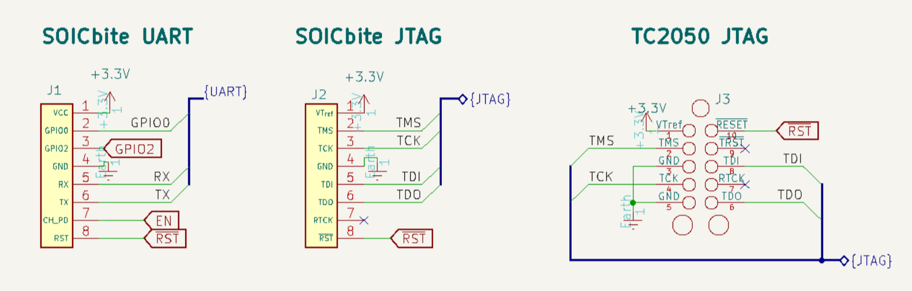



> [ESP-PROG Adapter Github Repo](https://github.com/0xjmux/ESP-PROG-Adapter)

One of the things I've noticed in maker communities working with MCUs like the ESP32 is how infrequently hobbyists include JTAG in their projects.

This is understandable, since I didn't start including it on my own hobby projects until I started working in embedded SwE. Plus, the process of figuring out how to set it up and get the pinout right can be kind of daunting.

I won't go into the history here but if you haven't heard of JTAG before think of it as a standardized set of pins that let you use a debugger with embedded firmware. You can program the board, step through the code instruction by instruction, check variable and register values, and more. It's really cool, and incredibly useful for embedded software development.

This whole project began because I needed a [JTAG adapter](https://github.com/0xjmux/ESP-PROG-Adapter) for debugging one of my own PCBs, and wanted to go with the industry standard, Segger's J-Link. Unfortunately, Segger discontinued the J-Link EDU (which I needed instead of the Mini because of its support for the Xtensa LX7 architecture used on the ESP32), so I had to go looking for another JTAG adapter.

After trying out a few options I gave Espressif's [ESP-Prog](https://docs.espressif.com/projects/espressif-esp-iot-solution/en/latest/hw-reference/ESP-Prog_guide.html) a try, and was pleasantly surprised. Here was a ~$12 Board with a small form factor and dual UART and JTAG interfaces running on the very well supported FT2232HL chip. It's supported by OpenOCD and GDB, and works right in VSCode. You can easily switch between 3.3 and 5V with a couple of jumpers, with BOOT and RST pins that make working with ESP chips a breeze.

Around the same time I also started playing with component-less debugging connectors. Finding [Tag-Connect](https://www.tag-connect.com/) while doing research for a project sparked my interest, but because of the cost I looked at other options. [PCB Card edge connectors](https://hackaday.com/2016/02/08/local-hacker-discovers-card-edge-connectors/) looked promising, but then I came across the very cool [SOICbite connector](https://hackaday.com/2019/06/13/soicbite-a-program-debug-connector-for-an-soic-test-clip/) and decided to go with that.

However, connecting any of these cables to a JTAG adapter was a mess of dupont cables with inevitable wiring issues, which meant manually checking all the pin mappings every time there was an issue instead of debugging the code I needed to work on. Plus, these connectors had their own standardized pinouts that were somewhat different from the ones used on debug boards, which means you can't just plug them directly into your JTAG debugger.

Having been inspired by Fescron's fantastic [Universal J-Link adapter](https://github.com/Fescron/universal-jlink-adapter/tree/master), I set out to make my own adapter to get rid of the cable mess from connecting the cables manually. A couple iterations later, I finally had something I was happy with.



   

After using it for a week, I realized how helpful something like this would be in making JTAG easier to approach for beginners. Simon Merrett's [SOICbite](https://github.com/SimonMerrett/SOICbite) fits the bill as a very affordable component-less connector which I had already created a JTAG pinout and Kicad symbols for. With those symbols and the ESP-Prog with adapter, component-less plug-and-play programming and debugging on the ESP32 can be had for less than $30.

So, I wrote it up to make it as easy to use as I could, and released everything under the permissive CERN OHL license. The Gerbers and schematic are available [on the Github repo under releases](https://github.com/0xjmux/ESP-PROG-Adapter/releases/latest), and the 5 or so parts you need for the adapter are listed [in the README with corresponding LCSC Part numbers](https://github.com/0xjmux/ESP-PROG-Adapter?tab=readme-ov-file#components).

The schematic contains any info you might need about using the adapter, but basically all the information you need should be on the adapter itself. There are some other fun touches like a UART loopback SOICbite connector on the adapter itself, which lets you test the functioning of your modified chip, plus reversible UART with jumpers, so a mistake with the TX-RX lines on your PCB won't get in the way of your debugging experience.

I considered selling the adapter board somewhere like Tindie, but it's such a simple board and the people that would be using it are already producing their own hardware designs, so you can just tack the PCBs and few components onto your next PCB order.

Enjoy!   -   [ESP-PROG Adapter Github Repo](https://github.com/0xjmux/ESP-PROG-Adapter)

<!-- ---
If you found the work I put into this valuable, I'd appreciate if you could buy me a coffee so I can continue devoting time to extensively documenting my projects like this.
 -->
