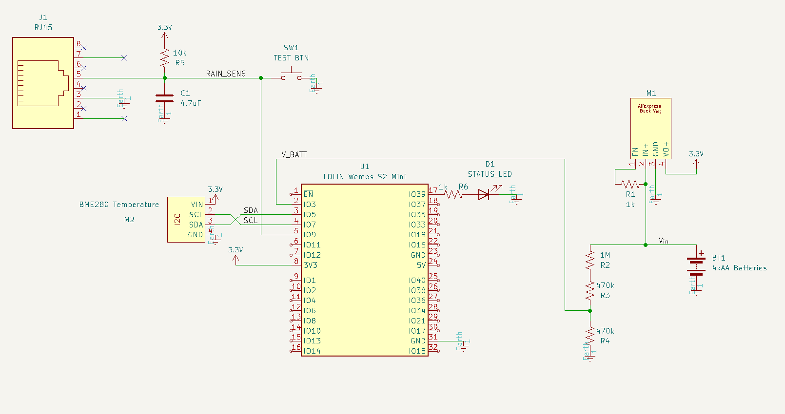

I'm in the process of building a weather station (which tbh is kind of a boring project, so unless I design some interesting hardware or something I probably won't post about it), but the majority of the hardware is still in the mail. 

In the middle of this project, SoCal was forecasted to be hit with a historic rainstorm, and I wanted to collect live hyperlocal weather data throughout the rainstorm so I could watch cool graphs of the rainfall rate while comfortably inside. However, my actual weather station isn't anywhere near done, so an evening of hacking something together began. 

**[FINAL SETUP IMAGE]**

I had a couple requirements for this project:
1. I wanted it to use the tipping bucket rain gauge from the [Sparkfun weather meter kit](https://www.sparkfun.com/products/15901) that I already had on hand
1. It had to integrate with my existing Home Assistant setup, since I didn't have time to set up another service to handle the data
1. The battery had to last all weekend, and it had to be able to live outside in wet conditions for that time
1. I had 2 hours to build it, and it had to be done with parts I already had on-hand. 
   
The biggest hardware challenge I faced was the connector for the rain gauge. I didn't have an RJ11 connector on hand, and didn't want to cut the cable and replace it with something else because I'd need the RJ11 later on for my actual weather station. After some frantic rummaging trying to find an jack that would work, I remembered I had an old desktop lying around that might have a modem card in it. Sure enough, it did and I was able to desolder the jack and transfer it to perfboard. 

Some breadboarding and a quick transfer to protoboard later, I had the hardware working. 

**[PERFBOARD CIRCUIT IMAGE]**

The whole thing is stupid simple, containing just the rain gauge, a BME280 Temperature/Pressure sensor, and a voltage divider so I can monitor the battery output voltage comfortably from inside. 

I hacked together a quick [ESPHome](https://esphome.io/) config, and stuck the entire thing in a tupperware container. After a quick test, I put it outside (since the rainstorm was already starting) and finished the firmware using the ESP's OTA update functionality.

It's very much a temporary solution, since while ESPHome makes setting up simple smart home devices a breeze, the connection period is a bit long and it's not very power efficient, even using deep sleep. I really wish there was an easy way to integrate with the ESPHome API from normal C/C++ programs. At least as far as I can tell from a cursory look, such functionality isn't easily available without modifying the ESPHome source. 

Anyways, here are some cool graphs from the rainstorm this weekend. 

**[LAST 5 MINS FROM FEB 4 - 6]**

Graph of rainfall rate from Feb 4-6, in 5 minute increments. Because of [how the rain gauge works](https://en.wikipedia.org/wiki/Rain_gauge#Tipping_bucket_rain_gauge) the minute to minute data can be a bit choppy, but a simple sum to 5 minute increments smooths things out while still allowing for short spikes in rainfall intensity to show. 

**[TOTAL DAILY RAIN FROM FEB 4-6]**

## Rainfall Stats
| Date             | Total Rain (in) | Highest Rate of rainfall (in/h) |
| --               | --              | --                              |
| February 3, 2024 | 0.011           | 1.32                            |
| February 4, 2024 | 1.45            | 2.64                            |
| February 5, 2024 | 1.77            | 5.28                            |
| February 6, 2024 | 1.45            | 6.6                             |

